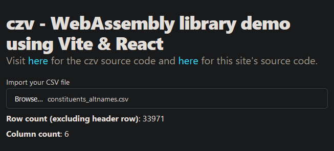

# czv - web-demo

Demo website for the [czv](https://github.com/rzmk/czv) WebAssembly library built with Vite & React.



## Development

1. Install the packages:

```bash
bun install
```

2. Build the site:

```bash
bun run build
```

3. Serve the site:

```bash
bun preview
```
